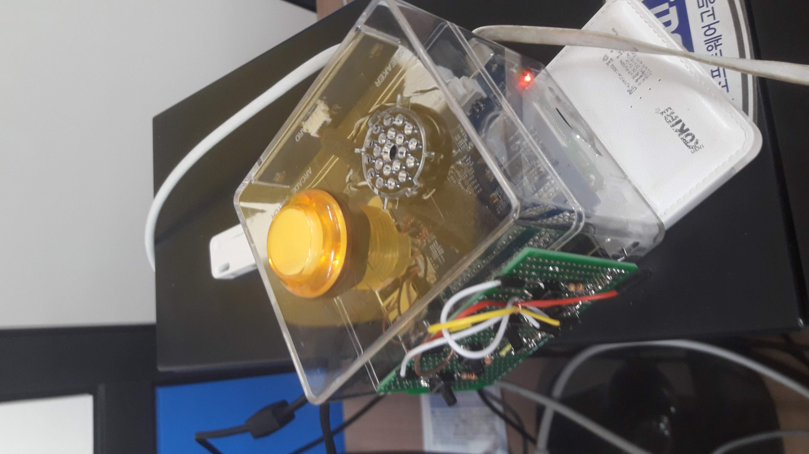

# MP3-Player

사용자가 휴대하면서 기기에 내장된 음악을 재생할 수 있는 장치이다.

# 조작법
상단에 장착된 버튼으로 기기의 전원 상태를 확일 할 수 있다.
상단에 장치착된 스피커로 노래를 들을수 있다.
전면에 장착된 버튼 4개로 음향 조작, 선곡을 할 수 있다.
하단에 장착된 보조 배터리로 휴대중에 전원을 공급할 수 있다.
# 개발시 문제점
KT 기가지니 메이커스 키트를 기반으로 개발했기 때문에 일부 GPIO 포트는 기가 메이커스에 할당 되어서 사용할 수 없었다.
# 문제점 해결 방안
해당 기가지니 메이커스 키트가 사용하는 핀을 우회하여 회로를 재설계 하였다.
# 향후 개선 방안
버튼에 캡을 씌워 조작할 때 편리성을 더 한다.
